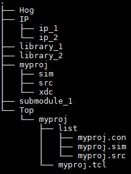

# Setting up a HDL repository with HOG

In this section we will describe how to set-up a new project that uses HOG for the Continuous Integration (CI).
In this section  we will make no assumptions on the code you already have.
If you have a well established repository with lot of code in it please read this section carefully before reading the [Convert existing project to hog](#convert-existing-project-to-hog) section.

## Project directory structure
In order for HOG to be simple and add little overhead work, some fixed directories and file names are needed in the HDL repository. A typical directory structure is shown in figure: 



HDL source files, together with constraint files and simulation files can be located anywhere in the repository. We find useful to have a directory structure that reflects the __libraries__, but you can do as
you please.

A HOG-handled repository can contain many (Vivado/Quartus) projects, each of them corresponding to a subdirectory of the __Top__ folder that we will call the "top project directory". In the figure above we have just one project called __myproj__. 
Each top project directory **must** contain all of the following:

- A tcl file that **must** be named the same as the top project folder (plus the .tcl extension), we will call this file the "project tcl file".
- A __list__ subdirectory containing the so-called list files i.e. some text files containing the names of the source files to be included in the project.


In figure, the project is called __myproj__ hence the project tcl file is called __myproj.tcl__.

When you create the project, running the `HOG/CreateProject.sh` HOG runs the project tcl file using Vivado or Quartus and creates the complete project in another directory, in our case `VivadoProject/myproj` or `QuartusProject/myproj`. In this directory you will find the typical Vivado or Quartus file structure.


## Multiple projects or multiple repositories?
As is now clear, a HOG-handled repository can contain multiple
projects. You may wonder when it is the case of having many projects
in the same repository and when you want to create different
repositories.

### Using different projects in the same git repository
You should use many projects in the same repository when they share a
significant amount of code.
In this case, the version of the repository will be shared among all the
projects. This is meaningful if the projects are strongly
interconnected and it is unlikely for a project to change version
without any modification to the others.

A typical case when it is handy to use multiple projects in the same repository is when you are dealing with different devices (FPGAs) mounted on the same board.

In order to keep different parts of the project conceptually separated, it is possible to use many **libraries** as explained in the following. 
In this case, the version (and the SHA) will be evaluated independently for each library, so it is possible to tell at a glance if two binary files share the same library.

For example you can have an FPGA with a "infrastructure" library
containing all the circuitry to handle communication with the external
world,  and an "algorithm" library, containing the actual part of the
design that processes data. HOG libraries will allow you to tell if two
different binary files are generated using exactly the same source code
for the algorithm but they have a different infrastructure.

### Using different git repositories
If you don't have any code sharing between two HDL projects, or if the
shared code is minimal, you may think of having different
repositories.

In this case, everything will be decoupled, as the two repository are
two completely unlinked things. All that is explained in this guide
will have to be done with both repositories and you can also, in
principle, use two different version of HOG.

In case you have a shared part of the code, in order to avoid code
repetition, you can include the shared code as a git submodule.
This must be a third git repository, also independent from the
previous two.

If the code contained in the submodule is not meant to be working
stand alone, it is not necessary to include HOG in it.


## HOG directory
HOG repository should be included as a submodule into your HDL
repository, following these rules:

1. HOG must be in the root path of your repository
2. The directory name must be "HOG"

Moreover it is recommended not to include the submodule protocol
explicitly, it is much better to inherit it from the repository HOG in
included into.

To obtain this you can run the following commands in the root folder of your repository.

```bash
	git submodule add <protocol>://gitlab.cern.ch/HOG/HOG.git
	git config --file=.gitmodules submodule.HOG.url ../HOG/HOG.git
	git submodule sync
	git submodule update --init --recursive --remote
```

Remember to chose your protocol among ssh, https, git, or krb5.
Also note that `../HOG/HOG.git` must be replaced with the correct path, relative to your repository. 
A git error will be generated by `git submodule update --init --recursive --remote` if the path is not properly set.


## library directories
Library directories contain HDL files used for synthesis.
HDL files can be placed anywhere in your repository, but it is advised to place them in the root/library_X directory.
We suggest to put HDL files belonging to separate libraries in separate folders although this is not mandatory.
The exact structure or name of this folder is not enforced.

## Top level entity

The top module of your project is expected to be called `top_<project_name>`.
This module can be stored anywhere in the repository as long as the file containing it is linked in a [`*.src` file](#list-directory).
We suggest you to store the file containing the top level module for your project in the TOP folder.

HOG uses generics to track the firmware version.
A full list of the generics used by Hog can be found  in the [HOG generics](../02-Maintainer-Manual/07-Hog-generics.md) section.
A template for the top level file (in VHLD and Verilog) is available in the [Hog/Template](https://gitlab.cern.ch/hog/Hog/-/tree/master/Templates) directory.
A full description of the template can be found in the [available templates](../02-Maintainer-Manual/06-available-templates.md) section.

## Git submodules
HOG can handle Git submodules, i.e. if you have some module contained on a git repository you can simply add it to your project using:

```bash
    git submodule add <submodule_url>
```

They can be placed anywhere in your repository, but it is advised to place them in the root directory.
Suppose that you have 2 submodules called _sub_1_ and _sub_2_:

```
    Repo/sub_1
    Repo/sub_2
```

## Top directory

The __Top__ directory must be located in the root folder of the repository:
```
    Repo/Top
```

It contains one directory for each of your projects (say proj_1, proj_2, proj_3):

```
    Repo/Top/proj_1
    Repo/Top/proj_2
    Repo/Top/proj_3
```

### project directory

Each of the project directories must contain the tcl file that generates the project.

They must be named as follows:

```
    Repo/Top/<project_name>/<project_name>.tcl
```

A template for the `<project_name>.tcl` file is available in the [Hog/Template](https://gitlab.cern.ch/hog/Hog/-/tree/master/Templates) directory.
A full description of the template can be found in the [available templates](../02-Maintainer-Manual/06-available-templates.md) section.

### .tcl file

The .tcl file contained in the project directory must contain the instructions to build your project.
This can be a minimal tcl set-up specifying only the general project settings.
The last line of the tcl script is expected to be 

```bash
source $path_repo/HOG/Tcl/create-project.tcl
```

This command will instruct HOG to add all your files to the generated project.

One example for a Vivado project is can be found in `./Hog/Templates/top.tcl`.

More information on the tcl script can be found in the [project tcl file](../02-Maintainer-Manual/08-Project-Tcl.md) section.

### list directory

A directory named _list_ must be in each of the project folders.
This directory contains the list of files, that are plain text files, used to instruct HOG on how to build your project.
Each list file contains the list of file names to be added to the *proj_1* project.
HOG uses different kinds of list files, identified by their extension:

 - `*.src` : used to include HDL files belonging to the same library
 - `*.sub` : used to include HDL files belonging to a git submodule
 - `*.sim` : used to include files use for simulation of the same library
 - `*.con` : used to include constraint files
 - `*.ext` : used to include HDL files belonging to an external library

 __.src, .sub, .sim, and .con list files must use relative paths__ to the files to be included in the project.

 __.ext list file must use an absolute path__. 
 To use the firmware Continuous Integration this path must be accessible to the machine performing the git CI, e.g. can be on a protected afs folder.

More information on the list file can be found in the dedicated [list files](../02-Maintainer-Manual/09-List-files.md) section.

### Adding a new IP 
If you want to add a new IP core, please create it in out of context mode and save the .xci file (and only that one!) it in the repository in *repo*/*IP*/*ip_name*/*ip_name*.xci. 
Please note that the name of the folder must be the same as the xci file.
Now you can add the .xci normally to any source list file in the list folder of your project.

#### IP initialization files (.coe)

Please note that the `.gitignore` template provided by HOG adds constraints on the IP folder.
Out of all the files contained in *repo*/*IP*/, git will pick up only xci files.
Files with different extensions will be ignored.
If you have \*.coe files for RAM initialization or analogous files please make sure to store these files in a separate folder and point to them in the IP directory by using a relative path.

## Auto-generated directories
The following directories are generated at different stages of library compilation or synthesis/implementation time.
These directories should never be committed to the repository, for this reason they are listed in the .gitingore file.
You can always delete any of these directories with no big consequences: they can always be regenerated by HOG scripts.

### VivadoProjects
When you generate a project with HOG, it will create a sub-directory here. When everything is generated,  this directory contains one subdirectory for each project in the repository, containing the Vivado project-file. The name of the sub-directory and of the project file are always matching. In our case:

```
    Repo/VivadoProjects/proj_1/proj_1.xpr
    Repo/VivadoProjects/proj_2/proj_2.xpr
    Repo/VivadoProjects/proj_3/proj_3.xpr
```

The _Repo/VivadoProjects/proj_3/_ directory also contains Vivado automatically generated files, among which the Runs directory:

```
    Repo/VivadoProjects/proj_1/proj_1.runs/
```

That contains one sub-folder for every Vivado run with all the IPs in your project, the default Vivado synthesis run (synth_1) and implementation run (impl_1).
HOG will also copy ipbus XMLs and generated bitfiles into _Repo/VivadoProjects/proj_1/proj_1.runs/_ at synthesis/implementation time.

### ModelsimLib
Modelsim compiled libraries will be placed here

## Optional directories

### doxygen
The doxygen directory contains the files used to generate the HDL documentation.
A file named _doxygen.conf_ should be in this directory, together with all the files needed to generate your Doxygen documentation.
HOG works with Doxygen version 1.8.13 ore later.

## Wrapper scripts
There are three scripts that can be used to run synthesis, implementation and bitstream writing without opening the Vivado GUI. The commands to launch them are

```bash
	./HOG/LaunchSynthesis.sh <proj_name>
	./HOG/LaunchImplementation.sh <proj_name>
	./HOG/LaunchWriteBistream.sh <proj_name>
```

Launching the implementation or the bitstream writing without having launched the synthesis beforehand will run the synthesis stage too.
