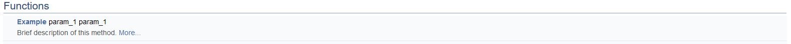
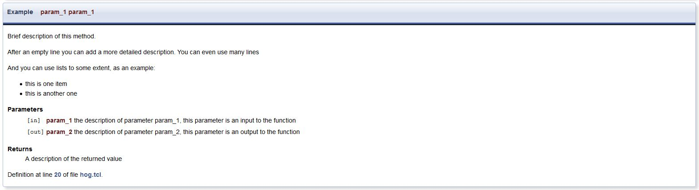

# Contributing to Hog
If you want to contribute to Hog please follow these instructions:

1. go to [Hog on gitlab](https://gitlab.cern.ch/hog/Hog)
2. check in the issues list that your improvements/features are not already under development.
3. create a new issue by clicking on "New issue" button
   - use an understandable short name
	 - write a compehensive description of the changes you what to make
   - must be assigned to you
	 - use  labels to indicate whether it is a new feature a bug-fix, etc
	 - (OPTIONAL) use due date to indicate when you expect to conclude your work
4. open a new merge request
   -  starting from your newly created issue
	    *  expand Merge Request dropdown
      *  select create merge request and branch
			*  branch name: feature/<issue_short_name>
	 -  click on "Create Merge Request":
	    *  a new merge request is created
      *  the merge request will be marked as WIP
			*  a new development branch is created
5. clone the TestFirmware repository 
	```console
	cd path_to_workdir/
	git clone --recursive https://gitlab.cern.ch/hog/test/TestFirmware.git
	```
6. Create a new branch innthe test firmware repository with the same name as the one in the main Hog repository
	```console
	cd path_to_workdir/TestFirmware/
	git checkout -b feature/<issue_short_name>
	```
7. Move Hog to your branch
	```console
	cd path_to_workdir/TestFirmware/Hog/
	git checkout feature/<issue_short_name>
	```
8. develop a test for your new feature *before writing your code*
   -  eventually modify existing tests
	 -  commit your tests
	```console
	cd path_to_workdir/TestFirmware/
	git commit <test1> <test1> <...> -m "Adding tests for feature/<issue_short_name>: <brief_test_description>"
	```
9. develop the code for the new feature (IN THIS ORDER!)
   -  all code must be documented using doxygen comments in the code!
	 -  commit your code
	```console
	cd path_to_workdir/TestFirmware/Hog/
	git commit <file1> <file2> <...> -m "Working on feature/<issue_short_name>: <brief_commit_description>"
	```
10. test your code
	 -  all test your new test must succeed
	 -  all existing test must succeed
	 -  if the test fail fix your code and commit it using --amend 
	```console
	cd path_to_workdir/TestFirmware/Hog/
	git commit --amend --no-edit 
	```
11. if your modification has any impact on the user/maintainer update the user [manual](#contributing_to_the_manual) accordingly
12. push your changes in the Hog repository
	```console
	cd path_to_workdir/TestFirmware/Hog/
	git push
	```
13. push your changes on the TestFirmware repository
	```console
	cd path_to_workdir/TestFirmware/
	git push --set-upstream origin feature/<issue_short_name>
	```
14. remove WIP status from your Merge Request
		-  go to [Hog on gitlab](https://gitlab.cern.ch/hog/Hog)
		-  navigate to your merge request
		-  click on "Resolve WIP status" button
15. drop us a line at [Hog support](mailto:hog@cern.ch)
16. check your Merge Request and address comments

# Documenting the code

All the code written to implement new features or correct bugs must be documented.
The main source of documentation is doxygen and comments in the code.
The doxygen documentation is collected in a devicated [website](https://hdl-on-git.web.cern.ch/hdl-on-git/test-doxy/index.html)

An example of how to document new functions

```tcl
# @brief Brief description of this method
#
# After an empty line you can add a more detailed description.
# You can even use many lines
#
# @param[in]	param_1	the description of parameter param_1, this parameter is an input to the function
# @param[out]	param_2	the description of parameter param_2, this parameter is an output to the function
#
# @returns	A description of the returned value
#
proc  Example {param_1 param_1} {
    if {[info commands get_property] != ""} {
        # some Vivado specific comments that will not end up in the documentation
    	return "Vivado"

    } elseif {[info commands quartus_command] != ""} {
        # some Vivado specific comments that will not end up in the documentation
    	return "Quartus"
    } else {
        # Tcl Shell
   		return "DEBUG_propery_value"
    }
}
```
The resulting documentation will be a brief description in the list of available functions:

 

Linked to a detailed description:

 

The same comment style can be used also for bash scripts provided you use functions in your script.

# Contributing to the Manual

This site uses MkDocs to render the Markdown files.
The source is hosted on gitLab: [Hog](https://gitlab.cern.ch/hog/Hog)

To contribute to the user manual plase read this section carefully.
You should first clone the repository:
```console
git clone https://gitlab.cern.ch/hog/Hog.git
```
As an alternative you can use the Web IDE directly from the gitlab website. This allows you to preview the resulting page.\
If you want to do this locally and haven't set up your permissions for local gitlab yet, follow the instructions [here](https://docs.gitlab.com/ce/ssh/README.html).\
Everything you'll need to edit is inside the `docs/` directory.
Sections are represented by subdirectories within `docs/` and, the section "home" pages  come from `index.md` files in each directory.
You can create further markdown files to add topics to the section.\
Any changes you make to this repo will be automatically propagated to this website when you push your commits into the $HOG_TARGET_BRANCH.

## Markdown

This manual is made in markdown, a simple language for formatting text. If you're not familiar, there is a handy cheatsheet [here](https://github.com/adam-p/markdown-here/wiki/Markdown-Cheatsheet). There are a few special cases for the specific flavor of markdown that gitLab uses (most notably for newline syntax) that are documented [here](https://docs.gitlab.com/ee/user/markdown.html).

## Continuous integration set-up

CI for this project was set up using the information in the [mkdocs](https://gitlab.cern.ch/authoring/documentation/mkdocs) repository. The generated website is automagically deployed [here](http://cern.ch/hog-user-manual)

