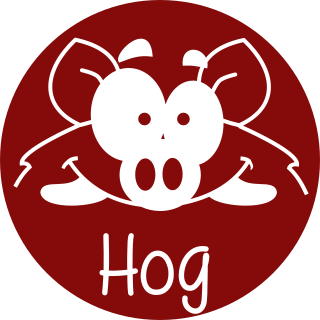

# Our site is coming soon!!
Here's a taste of what it will contain!




# Hog: HDL on git

## Introduction
Coordinating firmware development among many international collaborators is becoming a very widespread problem in particle physics. Guaranteeing firmware synthesis with Place and Route **reproducibility** and assuring **traceability** of binary files is paramount.

Hog tackles these issues by exploiting advanced git features and integrating itself with HDL IDE (Vivado or Quartus). The integration of these tools intends to reduce as much as possible useless overhead work for the developers.

## Rationale
For synthesis and Place and Route **reproducibility**, we need absolute control of:

- HDL source files
- Constraint files
- Vivado/Quartus settings (such as synthesis and implementation strategies)

For **traceability**, every time we produce a binary firmware file, we must:

- Know exactly how the binary file was produced
- Be able to go back to that point in the repository

To do this, Hog **automatically** embeds the git **commit SHA** into the binary file together with a more understandable **numeric version** __M.m.p__. Moreover, it automatically renames the file, including the version and inserts the hexadecimal value of the SHA so that it can be retrieved (using a text editor) in case the file gets renamed.

Avoiding errors is impossible, but the goal of Hog is to leave as little room as possible.

Another important principle in Hog is to **reduce to the minimum** the time needed for an external developer to **get up to speed** to work on a HDL project.
For this reason, Hog **does not rely on any external tool** or library. Only on those you must have to synthesise, implement (Vivado/Quartus) and simulate (Modelsim/Questasim) the design.

To start working on any project[^1] contained in a git repository handled with Hog, you just need to:

```console
git clone --recursive <HDL repository>
cd <HDL repository>
./Hog/CreateProject <project_name>
```
The project will appear in ./VivadoProject/<project>  (or ./QuartusProject/<project>) and you can open it with your Vivado GUI.

[^1]: If you don't know the project name, just run `./Hog/CreateProject` and a list will be displayed.


## What is Hog
Hog is a set of Tcl/Shell scripts plus a suitable methodology to handle HDL designs in a git repository.

Hog is included as a submodule in the HDL repository (a `Hog` directory is always present in Hog-handled repository) and allows developers to create the Vivado/Quartus project(s) locally and synthesise and implement it or start working on it.

The folder called `Top` is in the root of repository and it contains a sub-folder for each Vivado/Quartus project in the repository. Each of these directories has a fixed -easy to understand- structure and contains everything that is needed to re-create the Vivado/Quartus project locally, apart from the source files[^2] that the developer can place in the repository at his/her own convenience.
[^2]:Source files are the HDL files (.vhd, .v) but also the constraint files (.xdc, .sdc, .qsf, .tcl, ...). The IP files (.xci, .ip, .qip, ...) and the Board Design files must be stored in special folders, as explained later.

An `IP` (and possibly a `BD`) folder is used to store Intellectual Properties (and Board Design). Apart from these few mandatory directories, any structure of subdirectories can be created in the IP (and BD) folder.


## What's in the Hog folder?
The Hog folder contains plenty of Tcl and Shell scripts. 

Please run:
```console
	./Hog/Init.sh
```
to initialise the repository locally, following the instructions.

And you can always have a look yourself. Most of the scripts have a -h option to give you detailed instructions.
The most important script is `Hog/CreateProject.sh` that serves to create the Vivado/Quartus project locally. When creating the project, Hog integrates a set of Tcl scripts in the IDE software to handle and guarantee reproducibility and traceability.

Hog offers you :
- to work both with Windows and Linux
- a template to run a continous integration in your Gitlab repository
- the possibility of creating multiple project sharing one top level
- to have automatic tagging for easy versioning
- to store the output bistream on EOS

Everything is as transparent as we could think of. Hog is designed to use just a small fraction of your time to setup you local machine and get you to work to the HDL design as soon as possible.

## Hog user manual

In this website you can find a quick guide to learn how to work in a [Hog-handled repository](01-Getting-Started/01-existingProjects) or to [set-up a new one](01-Getting-Started/03-setupNewHogProject), as well as a complete user manual to understand all the details and learn how to maintain a Hog-handled repository.


## Contacts
Would you like to have fun with git and a Tcl? Please join us and read the [Contributing](03-Contributing) section.

To report an issue use the git issues in the [Hog git repository](https://gitlab.cern.ch/hog/Hog).
Please check in existing and solved issues before submitting a new issue.

For questions related to the Hog package, please get in touch with [Hog support](mailto:hog@cern.ch).

For anything related to this site, please get in touch with [Nicolò Biesuz](mailto:nbiesuz@cern.ch).

